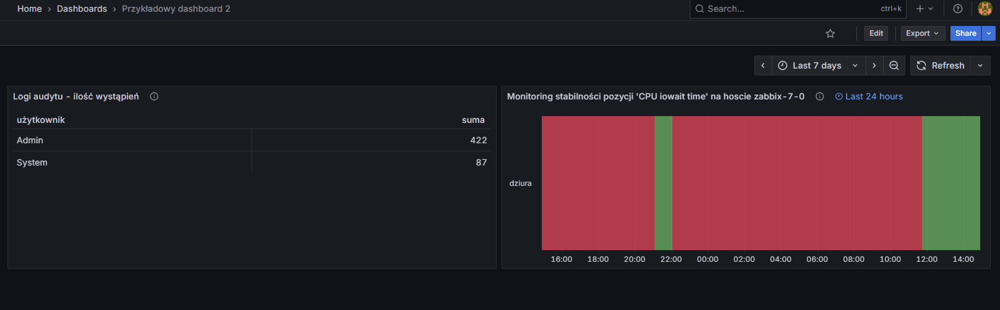

# Zabbix + grafana - cz.4

## Linki do artykułów

- [Zabbix Grafana - część 4 ]()

## Pliki:

- `Przykładowy dashboard 2-1764943025826.json` – cały dashboard zawierający skonfigurowane panele opisane w artykule.

## Import do Grafany

1. Otwórz Grafanę → **Dashboards → Import**.
2. Wybierz plik `Przykładowy dashboard 2-1764943025826.json`.
3. Ustaw datasource na  `Zabbix`.
4. Dashboard powinien być gotowy do użycia.

## Podgląd

