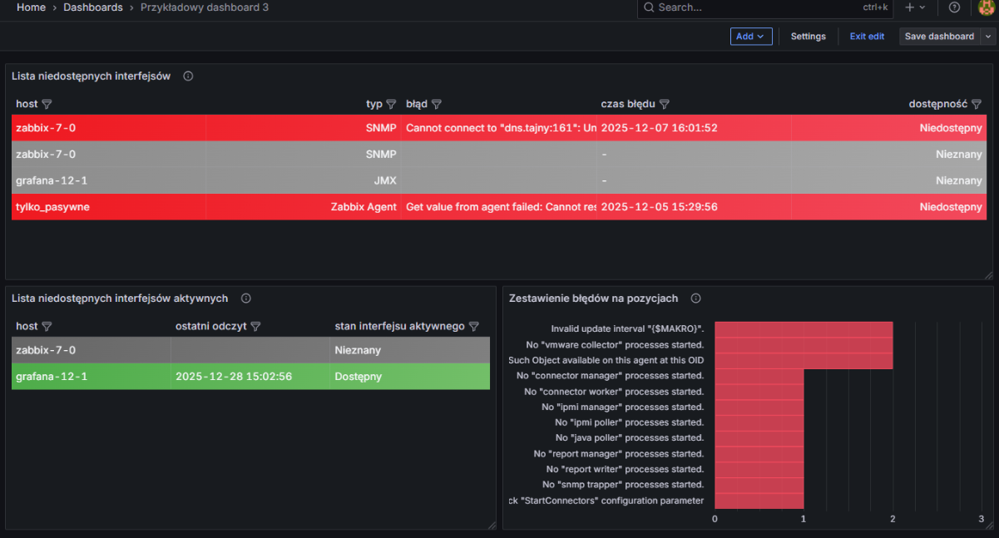

# Zabbix + grafana - cz.6 & cz.7 & cz.8 

## Linki do artykułów

- [Zabbix + grafana – część 6 – Parser UQL](https://sekurak.pl/zabbix-grafana-czesc-6-parser-uql/)
- [Zabbix + grafana – część 7 – Parser JSONata](https://sekurak.pl/zabbix-grafana-czesc-7-parser-jsonata/)
- [Zabbix + grafana – część 8 – Parser JQ](https://sekurak.pl/zabbix-grafana-czesc-8-parser-jq/)

## Pliki:

- `Przykładowy dashboard 3-1767029667448.json` – cały dashboard zawierający skonfigurowane wszystkie 3 panele.

## Import do Grafany

1. Otwórz Grafanę → **Dashboards → Import**.
2. Wybierz plik `Przykładowy dashboard 3-1767029667448.json`.
3. Ustaw datasource na  `Zabbix`.
4. Dashboard powinien być gotowy do użycia.

## Podgląd

